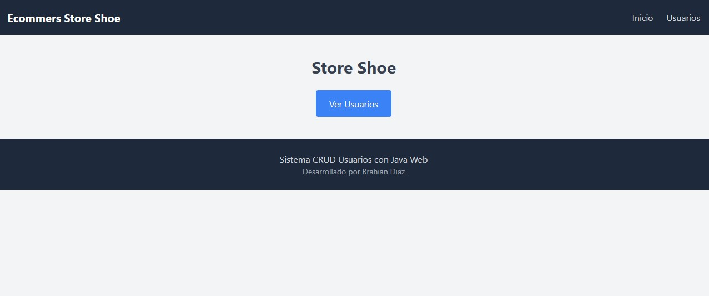
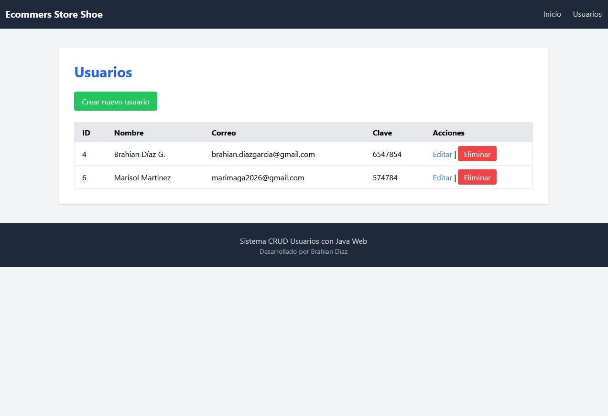
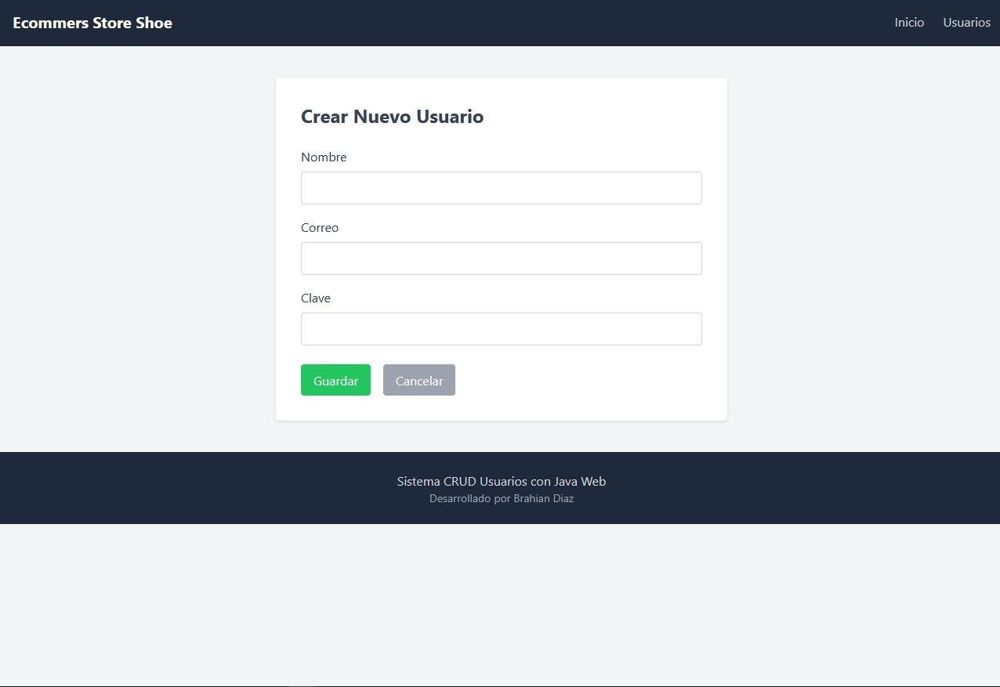
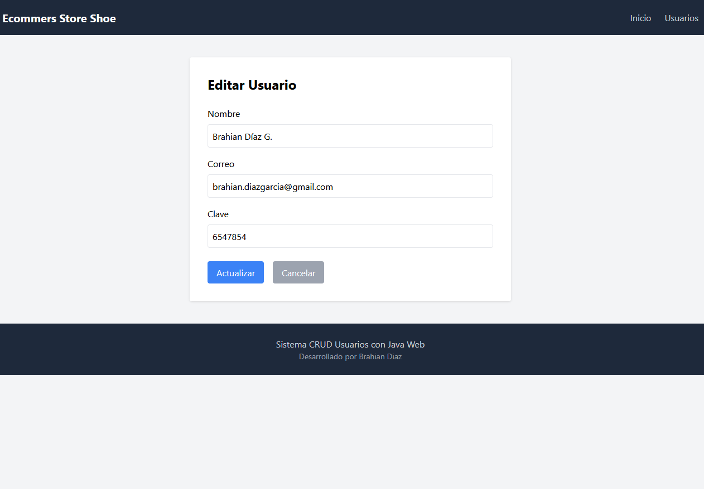
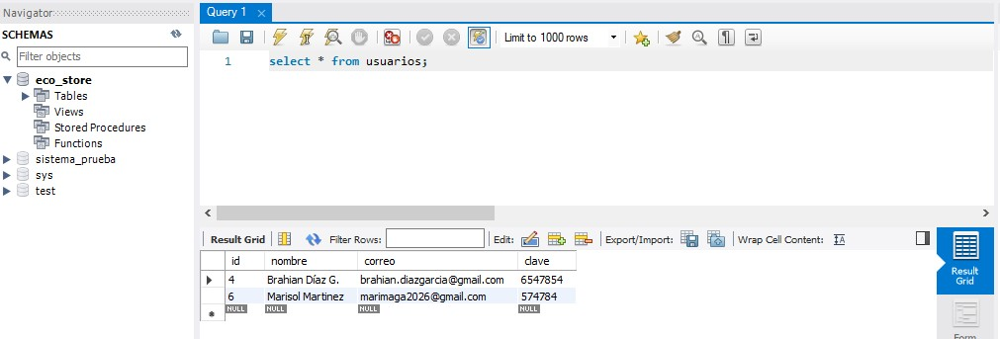
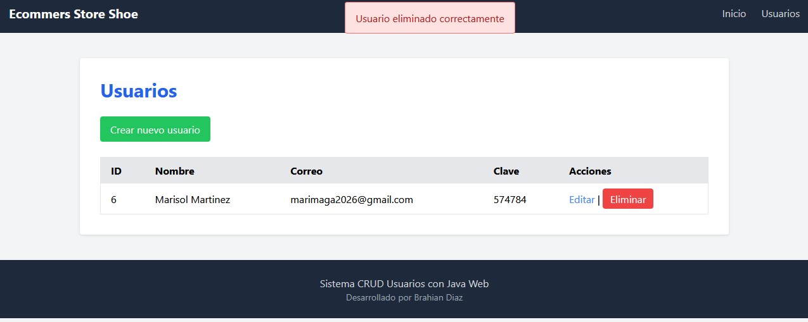

# 👟 Ecommerce Store Shoe – CRUD de Usuarios


Módulo **CRUD de Usuarios** desarrollado para el proyecto **Ecommerce Store Shoe**.  
Este módulo permite gestionar los usuarios del sistema mediante las operaciones básicas de **crear, listar, actualizar y eliminar registros**.

El sistema fue desarrollado utilizando **Java Web (Servlets y JSP)**, ejecutado en **Apache Tomcat**, conectado a **MySQL mediante JDBC** y con una interfaz diseñada usando **Tailwind CSS**.

---

# 📌 Características

- Inicio
- Listado de usuarios
- Nuevo usuario
- Edición de usuarios
- Eliminación de usuarios
- Conexión a base de datos MySQL
- Interfaz con Tailwind CSS
- Implementación del patrón DAO
- Arquitectura MVC

---

# 🧰 Tecnologías utilizadas

| Tecnología | Descripción |
|-----------|-------------|
| Java | Lenguaje principal del backend |
| JSP | Vistas de la aplicación |
| Servlets | Controladores |
| MySQL | Base de datos |
| JDBC | Conexión a la base de datos |
| Apache Tomcat | Servidor de aplicaciones |
| Tailwind CSS | Framework de estilos |

---

# 🏗 Arquitectura del proyecto

El proyecto sigue el patrón **MVC (Model - View - Controller)** y está organizado según la estructura generada por **NetBeans para aplicaciones Java Web**.

```
EcommerceStoreShoe
│
├── Web Pages
│   │
│   ├── META-INF
│   │
│   ├── WEB-INF
│   │
│   ├── includes
│   │   ├── footer.jsp
│   │   └── menu.jsp
│   │
│   ├── usuarios
│   │   ├── agregar.jsp
│   │   ├── editar.jsp
│   │   └── usuarios.jsp
│   │
│   └── index.html
│
├── Source Packages
│   │
│   ├── conexion
│   │   └── ConexionDB.java
│   │
│   ├── dao
│   │   └── UsuarioDAO.java
│   │
│   ├── modelo
│   │   └── Usuario.java
│   │
│   └── principal
│       └── UsuarioServlet.java
│
├── Libraries
│   ├── mysql-connector-j-9.6.0.jar
│   ├── JDK 25
│   └── Apache Tomcat
│
└── Configuration Files
```

# 🗄 Base de datos

Base de datos utilizada:

```
eco_store
```

Creación de la tabla de usuarios:

```sql
CREATE TABLE usuarios (
    id INT AUTO_INCREMENT PRIMARY KEY,
    nombre VARCHAR(100),
    email VARCHAR(100),
    clave VARCHAR(100)
);
```

---

# 🔌 Configuración de conexión

Ejemplo de conexión a MySQL usando JDBC:

```java
public class ConexionBD {

    public static Connection conectar() {

        Connection conn = null;

        try {

            Class.forName("com.mysql.cj.jdbc.Driver");

            conn = DriverManager.getConnection(
                    "jdbc:mysql://localhost:3306/eco_store",
                    "root",
                    "123456"
            );

            System.out.println("Conexión exitosa a la base de datos!");

        } catch (Exception e) {

            e.printStackTrace();

        }

        return conn;
    }
}
```

---

# 🚀 Instalación y ejecución

## 1. Clonar el repositorio

HTTPS:
```bash
git clone https://github.com/bdiaz747/Ecommers-Store-Shoe-CRUB-Usuarios.git
```
SSH:
```bash
git clone git@github.com:bdiaz747/Ecommers-Store-Shoe-CRUB-Usuarios.git
```
GibHub CLI:
```bash
gh repo clone bdiaz747/Ecommers-Store-Shoe-CRUB-Usuarios
```
---

## 2. Crear la base de datos

```sql
CREATE DATABASE eco_store;
```

Luego crear la tabla `usuarios`.

---

## 3. Ejecutar el proyecto

1. Instalar **Apache Tomcat**
2. Configurar Tomcat en **NetBeans**
3. Ejecutar el proyecto

---

## 4. Acceder al sistema

Abrir en el navegador:

```
http://localhost:8080/EcoStoreShoe
```

---

# 📷 Capturas del sistema

## Inicio

## Lista de usuarios



## Crear usuario



## Editar usuario



## Base de Datos 



## Eliminar Usuario




# 📚 Objetivo del proyecto

Este proyecto fue desarrollado con fines **académicos**, aplicando conceptos de:

- Desarrollo **Java Web**
- Conexión a bases de datos con **JDBC**
- Implementación de **CRUD**
- Uso del patrón **DAO**
- Arquitectura **MVC**

---

# 👨‍💻 Autor

**Brahian Díaz García**

Proyecto académico – SENA - 2026

---

# 📄 Licencia

Proyecto desarrollado con fines educativos.
